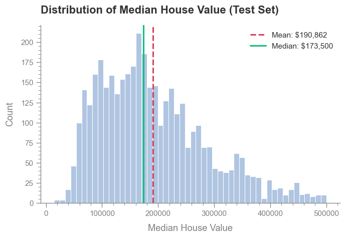

# California Housing Price Prediction

*An end-to-end machine learning project to predict median house values in California. This project follows the case study from Chapter 2 of Aurélien Géron's "Hands-On Machine Learning," covering everything from data exploration and preprocessing to model tuning and evaluation.*

## 🔗 Quick Links

* ➡️ [**View the Jupyter Notebook**](https://nbviewer.org/github/vytautas-fin/house-price-predicion-model/blob/master/california-house-price-prediction-model.ipynb)

* 💾 [**Dataset Source on Kaggle**](https://www.kaggle.com/datasets/camnugent/california-housing-prices/data)

## 🎯 Business Problem & Objectives

Accurately predicting housing prices is crucial for various stakeholders, including buyers, sellers, and real estate professionals. However, a property's valuation is influenced by numerous factors, and real-world datasets are often incomplete, making accurate predictions challenging.

The primary focus of this project is on the end-to-end process of building a machine learning model. The key objectives are to:

* **Handle Missing Data:** Implement and evaluate different techniques (Median & kNN imputation) to address missing values in the dataset.

* **Perform Feature Engineering:** Extract meaningful information from the available data to enhance the model's predictive power.

* **Build a Preprocessing Pipeline:** Construct a robust Scikit-Learn pipeline to automate all data preparation steps, ensuring consistency and scalability.

* **Evaluate and Tune Models:** Systematically train, evaluate, and fine-tune multiple regression algorithms to find the best performer.

## ⭐ Project Overview

This project successfully develops and evaluates three regression models—Linear Regression, Decision Tree, and Random Forest—to predict median house values in California. The models were rigorously compared using K-fold cross-validation, with **Root Mean Square Error (RMSE)** as the primary performance metric. The final model was then fine-tuned using `RandomizedSearchCV` to optimize its hyperparameters and evaluated on an unseen test set to provide an unbiased estimate of its real-world performance.

## 💡 Model Performance & Conclusions

#### Baseline Model Evaluation

Of the initial models tested, the **Random Forest** was the most effective, achieving a cross-validation **RMSE of approximately $44,000**. This represented a **25%** performance increase over the baseline Linear Regression model (RMSE ~$59,000). However, a significant gap between its training score and cross-validation score indicated **overfitting**, necessitating hyperparameter tuning.

#### Final Model Evaluation

The final, tuned Random Forest model achieved an **RMSE of approximately $37,000** on the unseen test set. This represents a further **16% improvement** over the baseline Random Forest, demonstrating the effectiveness of the hyperparameter tuning process. While this is a strong result, an error of $37,000 is still substantial, highlighting clear opportunities for further improvement.

- Final RMSE as a percentage of the Test Set Median: 21.4%.
- Model's typical prediction error ($37,208) is about 21.4% of the price of a typical house in the test set.

## 🗄️ Methodology

The project followed a structured, end-to-end machine learning workflow, from initial data exploration to final model deployment.

1. **Exploratory Data Analysis (EDA):** The process began with a deep dive into the dataset to understand its structure and features. This included univariate analysis (histograms, box plots) to understand distributions and identify capped values, as well as bivariate analysis (correlation matrices, pair plots) to uncover relationships between features. Geographical data was also visualized to identify housing price hotspots.

2. **Data Preprocessing:** A comprehensive preprocessing strategy was developed to prepare the data for modeling. This involved:

   * **Handling Missing Values:** Both Median and kNN imputation techniques were explored.

   * **Feature Engineering:** New, more predictive features were created from the existing data.

   * **Data Transformation:** A custom transformer was built for geographical coordinates, and various scaling and distribution transformations were applied.

   * **Categorical Encoding:** The `ocean_proximity` feature was converted into a numerical format.

3. **Preprocessing Pipeline:** To ensure all transformations were applied consistently, a full Scikit-Learn pipeline was constructed. This pipeline automated all the preprocessing steps, making the workflow robust and easily reproducible.

4. **Model Selection and Training:** Three different regression models (Linear Regression, Decision Tree, and Random Forest) were trained and evaluated using K-fold cross-validation to establish a performance baseline.

5. **Model Fine-Tuning:** The best-performing model, Random Forest, was selected for hyperparameter tuning. `RandomizedSearchCV` was used to efficiently search for the optimal combination of preprocessing and model hyperparameters.

6. **Final Evaluation:** The final, tuned model was evaluated on the held-out test set to provide a final, unbiased measure of its performance on new, unseen data.

## 🚀 Future Improvements

* **Expand Hyperparameter Tuning**: A more exhaustive search, potentially using a larger `n_iter` value or a more focused `GridSearchCV`, could yield further performance gains.

* **Conduct a Detailed Error Analysis**: Manually investigating the model's largest prediction errors could uncover patterns (e.g., underperformance in rural areas) that would guide the next phase of feature engineering.

* **Try More Powerful Models**: Advanced gradient boosting models such as **XGBoost**, **LightGBM**, or **CatBoost** often outperform Random Forest on tabular data and represent a logical next step.

* **Create a Model Ensemble**: Combining the predictions of several strong models (a technique known as **stacking** or **blending**) can often yield a final result that is more accurate than any single model.

